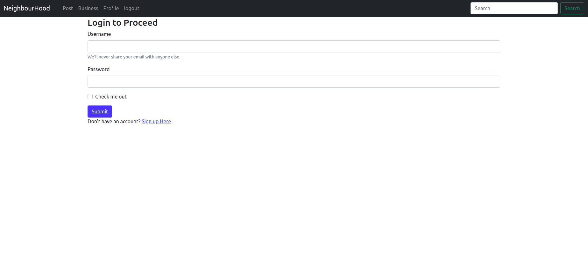
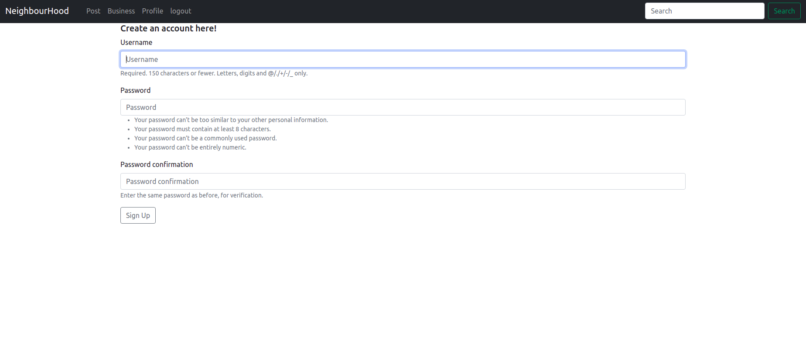
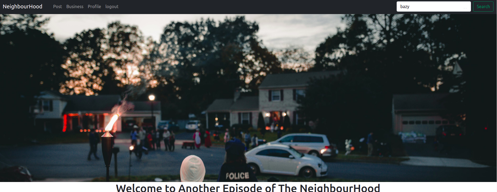
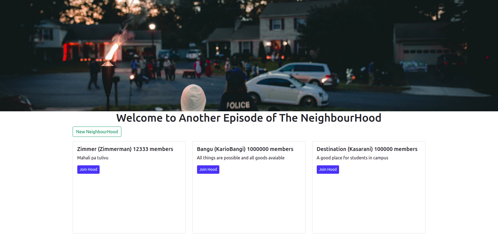
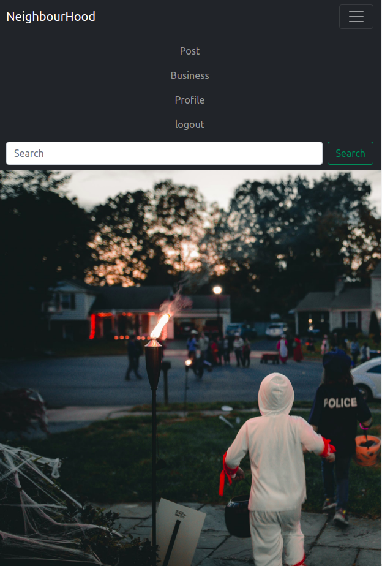
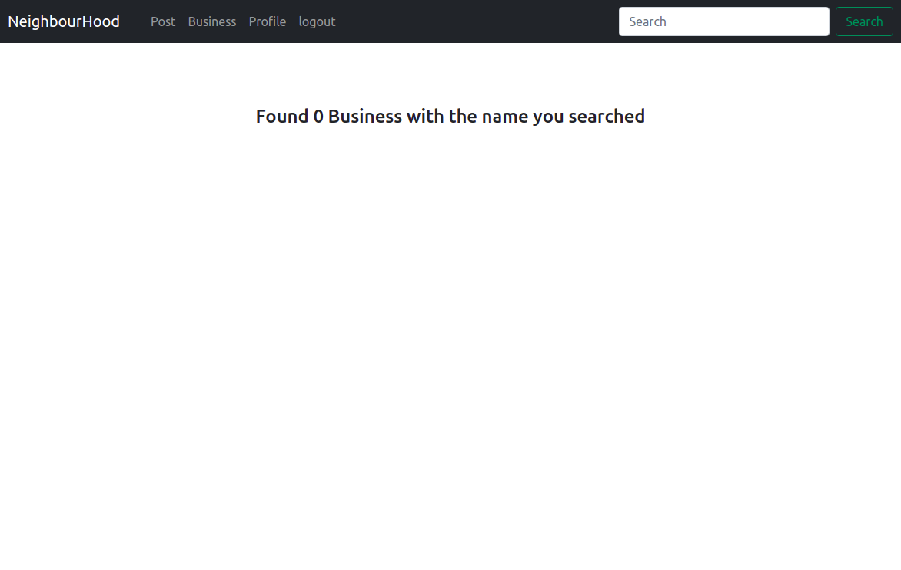

# NeighbourHood

#### Created By Grievin Otieno on 02-11-2021

## Description

NeighbourHood is an application about the neighbourhood, it allows you to register a neighbourhood and keeps track of activities in the Neighbourhood, You can search for a Neighbourhood, and also vacate the neughbourhod into another.


## Setup Requirements

* Git
* Github
* PostgreSQL
* Django
* Python 3.8
* Pip
* Web-browser or your choice


## Setup Installation

- Copy the github repository url
- Clone to your computer (git clone )
- Open your terminal then navigate to the directory of the project you just cloned to your computer
- Run the following commands to start the server using virtual environment that you have created

```
python3.8 -m venv virtual
```

- To activate the virtual environment

```
source virtual/bin/activate
```

```
curl https://bootstrap.pypa.io/get-pip.py | python
```

```
pip install -r requirements.txt
```

- To copy .env.example to .env

```
cp .env.example .env
```

- Edit the .env file and replace the values with your own Cloudinary credentials and database credentials

- To run the server

```
python manage.py runserver

```

- Open the browser and navigate to http://127.0.0.1:8000/ to see the application in action

## Technologies Used

The following languages have been used on this project:

* Python 
* Django
* PostgreSQL
* Bootstrap
* HTML

## Setup/Installation Requirements

- Live link to view the project <a target="_blank" href="https://django-instagram12.herokuapp.com/">NeighbourHood</a>

## Some Screenshots
- User Authentication
  

  

- Landing page

  

  


- Image responsive

  

- Search Functionality




## Known Bugs

Bugs in displaying Business category and post category but soon will work on it

## Support and contact details
Lets interact, Work Together or Contribute to my code, catch me @ 
* enogroti@gmail.com or d+254714880548

## License

MIT Copyright (c) 2021 Grievin Otieno